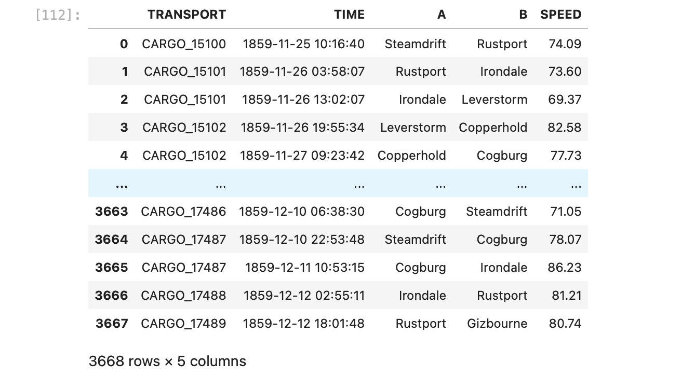
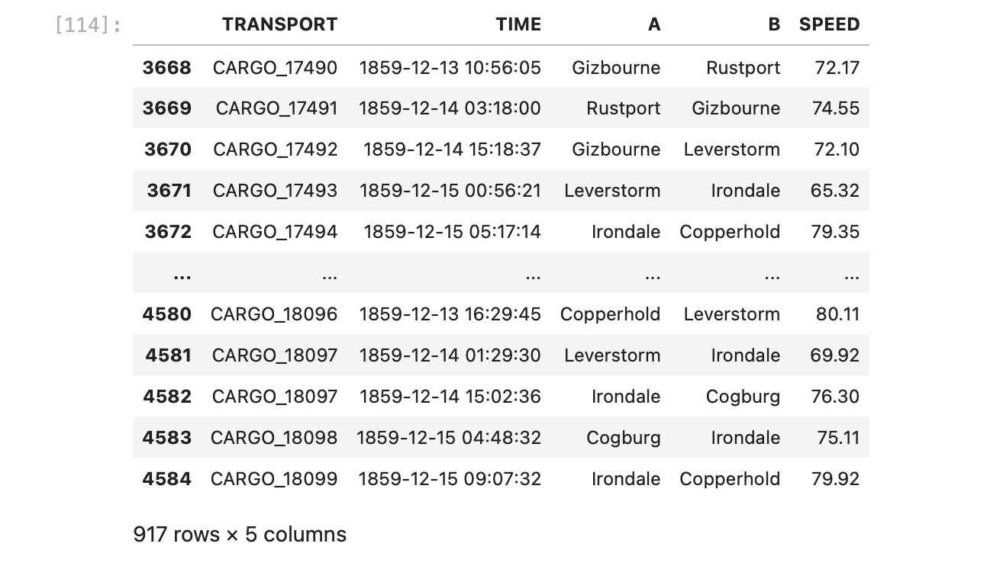

Previous: [Compute ETA with fixed speed](transport-tycoon_22.md) | [Index](transport-tycoon.md) 

# Episode 2.3: Mine historical data for travel speed

In the previous exercise we computed Estimated Time of Arrival (ETA) for a cargo truck. 

The truck moved between two locations with a **predefined speed**. We wrote a script that loaded the travel speed for each road from a file and computed fastest travel route between any two locations:

```bash
> route Steamdrift Leverstorm
 0.00h  DEPART  Steamdrift
14.26h  ARRIVE  Cogburg
24.81h  ARRIVE  Irondale
31.88h  ARRIVE  Leverstorm
```

In this exercise, we will no longer rely on predefined speed values. Instead, we *mine* probable speeds from historical travel data or, put in another way, we will **train a model** for predicting speeds of future travels. 

To **validate the model**, we will use the standard approach: we will hide some observations (trips) when training the model, then predict speeds for these previously ignored trips, and check how accurate our prediction was. 

We will count **absolute difference** between the real (but yet hidden) speed  and predicted speeds: we say that the smaller is the difference (averaged over all such hidden trips), the higher is the model quality. 

## Training

We have a training dataset [s02e03_train.csv](transport-tycoon/s02e03_train.csv). It is a CSV file with the travel history that looks like this:



This file is a travel log of a company that runs multiple trucks. 

A simple way to predict truck speed on a road is to average all truck speeds observed on this road in the past. 

Known events are called *observations*, or *samples*, and we write `average_speed = sum(speed_samples) / len(speed_samples)`. 

Here are our steps to build the model:

1. Load travel history from [s02e03_train.csv](transport-tycoon/s02e03_train.csv).
3. For each road, compute average travel time. 
4. Use average travel times to _predict_ future travel speed.

## Validation

Now, how do we know if our predictions make any sense? We need to validate our findings. For convenience, we have already "hidden" some travel times, and make them available in a separate dataset: [s02e03_test.csv](transport-tycoon/s02e03_test.csv). 

 

We validate our model by going through each row in this validation dataset and making a prediction for it. We then take the absolute difference (*error*) between predicted speed and the real speed from this table.

```
PREDICTED SPEED | REAL SPEED | ERROR    | NOTE
72.11           | 72.44      | 0.33     | This is quite good!
72.11           | 92.44      | 20.00    | The model is WAY off here
```
Smaller the difference between these numbers (or *error*)- more accurate the model is.

In order to communicate model accuracy the others, we would need to somehow **aggregate all errors into a single model error**. 

We can avoid this pitfall by considering error values without the signs (it does not matter if our prediction is smaller or bigger than the actual value: the absolute error is the same in both cases). In statistics, it is typical to use the *square* of the error instead of the absolute value, and to average the squared errors of all predictions in the test set. 

This metric is known as *Mean Squared Error* (MSE):


The above formula can be computed using the following Python code:

```python
error_sum = 0
for loc_a, loc_b, actual_hours in test_dataset:
  preducted_hours = predict(loc_a, loc_b)
  difference = actual_hours - predicted_hours
  square = difference * difference
  error_sum += square
mse = error_sum / len(test_dataset)
print(f"Mean squared error is {mse}")
```

To reiterate:

1. For each row in [s02e03_test.csv](transport-tycoon/s02e03_test.csv) use the trained model to predict travel speed.
2. For each row compute error by computing difference between the observed speed (from the file) and predicted speed (from the model).
3. Aggregate these errors into a single error number by using the Mean Squared Error formula.

## Task

Write a console application that:

- uses the training dataset `s02e03_train.csv` to compute average travel speed for each road;
- predicts travel speed for each row in the validation dataset `s02e03_test.csv`;
- computes Mean Squared Error for these predictions and prints the result.

For example:

```
> python3 solution_s0203.py
MSE is 4444.333
```

The number above is just a sample. Your number will be slightly different :)

## Extra Challenge

You will see that MSE is quite high. This is explainable, since we have used the most simple and naive way of predicting the travel speed - by averaging the history.

In fact, it should be possible to improve prediction accuracy significantly by leveraging additional information provided in the training data. The simulation ran in a world with the traffic congestion.

For the extra challenge, can you use timestamp data (time of the day and day of the week) to train and build a more accurate model?

## Next

- Contribute your solution to [a list of all solutions](transport-tycoon/README.md)! Linked page explains how to do that.
- If you have any questions or comments - we have a [Discord chat](https://discord.gg/jHGbUwxDgv).
- Next episode will be published within 2 weeks. You can watch this repository or [subscribe to the mailing list](https://tinyletter.com/softwarepark).
- 🔜 Episode 2.4: Setup training pipeline and iterate

